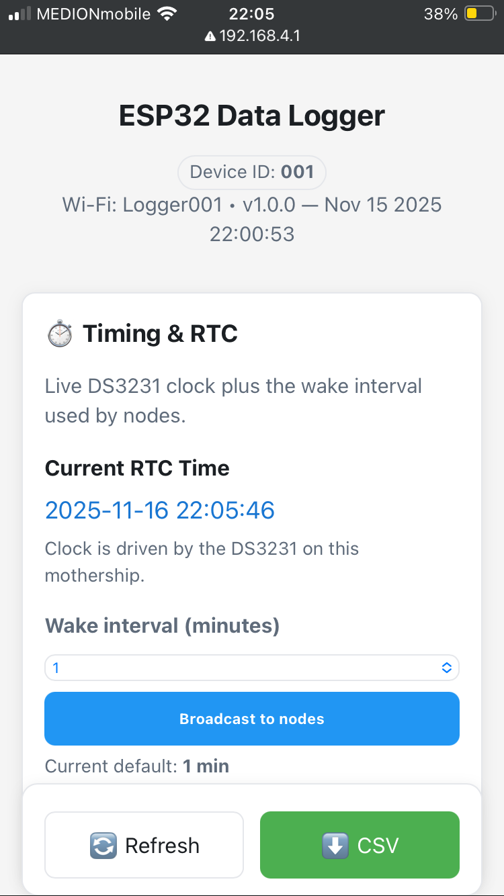
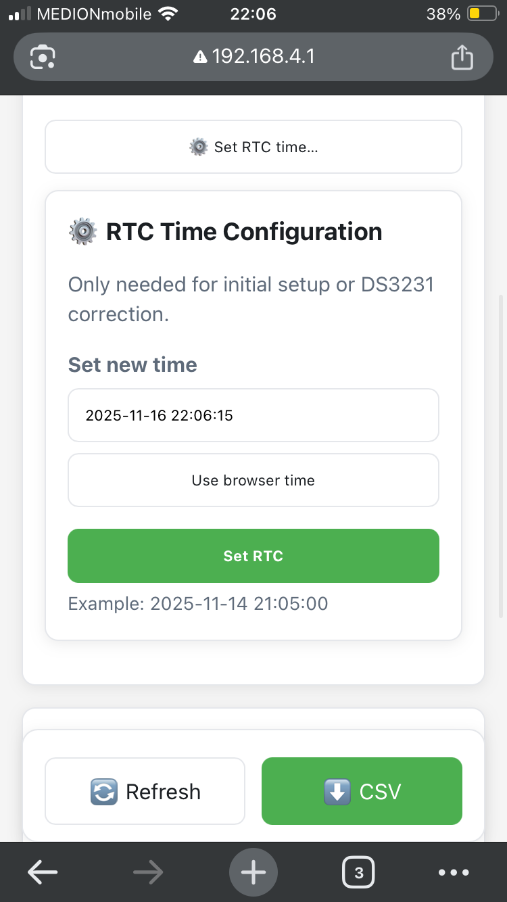

### System Overview

The system is a small, self-contained **wireless sensor network** for environmental monitoring.

- A central **“mothership”** unit sits on site.
  - It creates its own Wi-Fi network so you can connect with a phone or laptop.
  - It keeps accurate time via a real-time clock (DS3231).
  - It stores all incoming data onto an SD card as a CSV file.
  - It remembers which nodes are **paired** and **deployed**, plus their IDs, names, and wake interval, in non-volatile storage (NVS).
  - It answers **time sync requests** from nodes and can push periodic fleet-wide time sync.
  - It exposes a simple web dashboard to manage the fleet.

- Multiple **sensor nodes** are deployed around the site.
  - They measure environmental variables like air temperature (other sensors can be added later).
  - They use a low-power wireless protocol (**ESP-NOW**) to send data back to the mothership.
  - They wake on a configurable interval driven by the **DS3231 alarm** and send a reading each time.
  - They store their own state in NVS, including:
    - Which mothership they belong to (MAC address)
    - Whether they are deployed
    - Their wake interval
    - Whether their RTC is synced, plus the last time-sync timestamp
  - On boot, they reload this state and continue from where they left off.

Everything is designed to be:

- **Low-cost**  
- **Field-friendly** (minimal physical UI; a clean web dashboard)  
- **Robust to power loss**  
  - The mothership and nodes keep their pairing / deployment state in NVS.  
  - Each node’s DS3231 is backed by a coin cell so time survives main power loss.  
  - If the RTC is still valid, a deployed node will restart and simply keep sending data.

---

### Node Lifecycle: from “seen” to “deployed”

1. **Discovery**

   When a sensor node is powered up for the first time, it doesn’t know which mothership it belongs to.  
   It simply announces: “I’m here, my ID is `TEMP_001`, I’m a temperature node.”

   The mothership hears those announcements and registers the node.  
   The node then appears in the **Node Manager** list in the web dashboard with state **Unpaired**.

   > On subsequent boots, if the node has already been paired, it loads the stored mothership MAC from NVS, skips discovery, and reconnects automatically as **Paired** or **Deployed** depending on its saved state.

2. **Pairing**

   From the **Node Manager**, you tap a node to open its **Configure & Start** page.

   There you can:
   - Set a **numeric Node ID** (e.g. `001`) – used in CSV logs
   - Set a **friendly name** (e.g. `North Hedge 01`)

   Choosing **Action: Start / deploy** on an **unpaired** node causes the mothership to:

   - Send a `PAIR_NODE` command to the node.
   - Send a `PAIRING_RESPONSE` confirming the association.
   - Store the pairing in its own NVS.
   - The node stores the mothership MAC in its NVS.

   At this point the node is **bound/paired**, but not yet actively sending measurements until it’s deployed.

3. **Deployment**

   When you’re ready to start logging:

   - Open the node’s **Configure & Start** page.
   - Choose a wake interval (e.g. 5 minutes).
   - Select **Action: Start / deploy** and submit.

   The mothership will:

   - Broadcast the chosen wake interval to paired/deployed nodes (`SET_SCHEDULE`).
   - Send a `DEPLOY_NODE` command which includes the current time from the mothership’s DS3231.

   The node will:

   - Set its DS3231 to the time in the `DEPLOY_NODE` message.
   - Store in NVS:
     - Mothership MAC
     - Deployed flag
     - Wake interval
     - “RTC is synced” flag + last time-sync timestamp
   - Begin using the DS3231 alarm to wake and send sensor data on each interval.

   In the dashboard, the node now shows as **Deployed**, with a “Fresh / OK / Stale / Unknown” time-health pill based on when it last received a `TIME_SYNC`.

   > After a power cut, a deployed node reloads this state from NVS.  
   > If its RTC still has valid time, it sees it is deployed + synced and simply resumes sending data without needing to be redeployed.

4. **Reverting / Unpairing**

   - **Revert to Paired (Stop)**  
     If you want a node to stop sending data but keep its association with the mothership:

     - Open **Configure & Start**.
     - Choose **Action: Stop / keep paired**.

     The node will stop transmitting regular measurements but still remembers which mothership it belongs to and can be redeployed later.

   - **Unpair**  
     If you want a node to completely forget the mothership and behave as “new” again:

     - Open **Configure & Start**.
     - Choose **Action: Unpair / forget**.

     The mothership removes the node from its paired list and clears its ID/name metadata.  
     The node clears its stored mothership MAC and deployed/synced flags.  
     On next boot it will appear again as **Unpaired**, advertising itself to any listening mothership.

---

### Web Dashboard

The mothership exposes a simple web interface:

- Connect to the Wi-Fi network **`Logger001`**.
- Open a browser and go to **`http://192.168.4.1/`**.

From there you can:

- See the **current time** on the mothership (live-updating).
- Set the **global sampling / wake interval** for nodes (e.g. every 1, 5, 10, 20, 30, or 60 minutes).
- Start a **Discovery scan** so new nodes can announce themselves.
- Use the **Node Manager** to:
  - View all nodes and their states (Unpaired / Paired / Deployed)
  - See per-node time-health indicators (Fresh / OK / Stale / Unknown)
  - Open each node’s **Configure & Start** page to:
    - Set numeric Node ID and friendly name
    - Deploy / stop / unpair that node
- See which nodes are currently deployed and actively sending data.
- Download the full **CSV log** of all data recorded to date.

#### Screenshots

---

### Data Format

All data is stored in a single CSV file on the SD card:

Each **sensor data row** includes:

- Timestamp (from the mothership RTC)
- Numeric node ID (e.g. `001` – if configured, otherwise the firmware ID is used)
- Human-readable node name (e.g. `North Hedge 01`, if configured)
- MAC address of the node
- Sensor type (e.g. `AIR_TEMP`)
- Measured value

The mothership also logs simple status rows, such as:

- Periodic `"MOTHERSHIP,STATUS,ACTIVE"` heartbeats (to show that the system is alive).
- Optional `"MOTHERSHIP,TIME_SYNC_FLEET,OK"` rows when a fleet-wide time sync is performed.

This format keeps the file easy to open in Excel, R, Python, etc., while still containing enough metadata (ID + name + MAC) to trace which physical node produced each measurement.

---

### What’s Working Now

- Nodes can be **discovered**, **paired**, **deployed**, **stopped**, and **unpaired** from the web UI.
- The system behaves correctly across reboots and power cycles:
  - The mothership remembers which nodes are paired or deployed via NVS.
  - Nodes remember which mothership they belong to, their wake interval, whether they are deployed, and whether their RTC is synced.
  - If the node’s RTC still has valid time (coin cell present), deployed nodes resume sending data automatically after power is restored.
- Nodes and mothership perform explicit **time sync** using `REQUEST_TIME` / `TIME_SYNC` messages, and the UI surfaces a simple time-health indicator per node.
- Data is reliably logged to the SD card in a simple, analysis-friendly CSV format.
