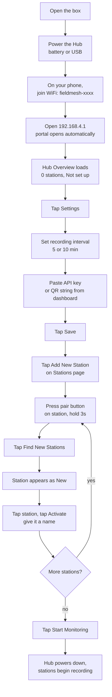
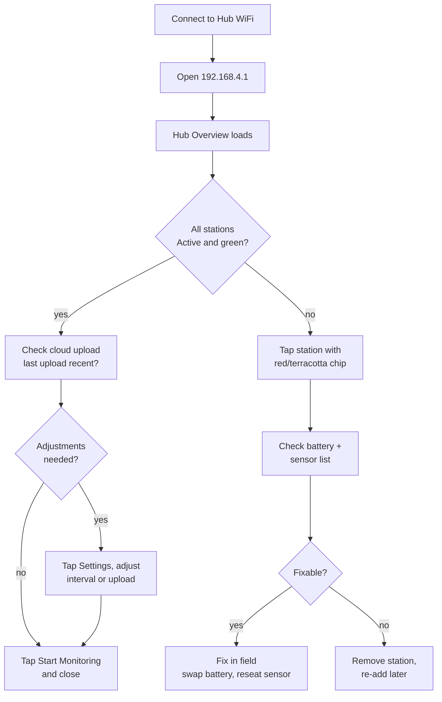
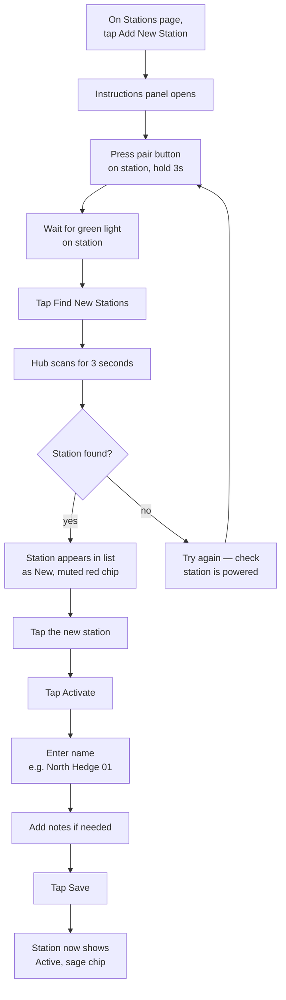
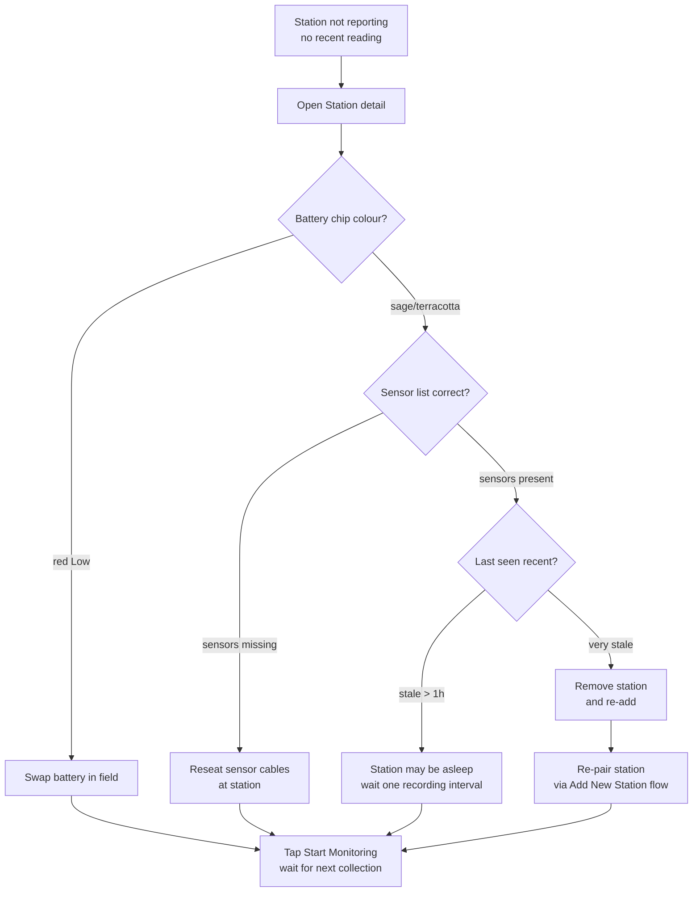

# fieldMesh Field UI Redesign — Captive Portal (192.168.4.1)

**Date:** 2026-06-26
**Status:** Design document (no code changes)
**Project:** fieldMesh — ESP32 environmental sensor network
**Scope:** Mothership WiFi AP config portal served from ESP32 flash at `192.168.4.1`
**Companion docs:**
- `docs/FIELDMESH_DASHBOARD_DESIGN.md` — cloud dashboard visual reference
- `docs/FIELDMESH_USER_ONBOARDING_BRIEF.md` — provisioning flow, QR/API-key design
- `docs/FIELDMESH_CLOUD_UPLOAD_PROTOCOL.md` — JSON upload payload
- `mothership/firmware/v2/src/config/config_server.cpp` — current Field UI implementation

---

## 1. Executive Summary

The mothership's captive portal is the only on-device interface a field user sees. Today it speaks in developer language — "nodes", "deploy/paired/unpaired", "sync window", "wake interval", "ESP-NOW", "Flash/LittleFS/NVS". The target users are ecologists, town planners, site valuers, and subdivision planners. They do not need to know that the radio protocol is ESP-NOW or that logs live in LittleFS. They need to know: *is my network recording, are my stations healthy, is data reaching the cloud.*

This document redesigns the Field UI into **four plain-English pages** — Hub Overview, Stations, Settings, Data Export — using the sage green / terracotta / warm stone palette already applied to the cloud dashboard. The hierarchy is renamed to **Hub → Stations → Sensors**. All mechanism details (ESP-NOW, MAC addresses, flash filesystems, modem AT commands, phase alignment, config versions, firmware build strings) are hidden from the default view and moved to a collapsed Advanced/About section.

**Confirmed decisions:**
- Four pages maximum, mobile-first, card-based layout.
- Terminology mapping in §3 is binding for all user-visible strings.
- Existing async-form pattern and captive portal redirect are preserved.
- CSS stays inline in `PROGMEM`; no external resources, no internet.

**Open questions:** see §12.

---

## 2. User Personas and Mental Models

### 2.1 Personas

| Persona | Role | What they do at the portal | What they never need to see |
|---|---|---|---|
| **Ecologist** | Deploys stations, checks data health | Start monitoring, check station batteries, export CSV | ESP-NOW, MAC, flash, config versions |
| **Town planner** | Occasional check-in during a study | Connect WiFi, see green status, leave | Sync anchors, retry counts, modem AT |
| **Site valuer** | One-off deployment, low technical confidence | Guided first-time setup, name stations, start | LittleFS, NVS, firmware build strings |

### 2.2 Mental model

The user thinks in three layers:

1. **The Hub** — "the box I connect my phone to." It collects data and uploads it.
2. **Stations** — "the sensor boxes out in the field." Each has a name, a battery, and a set of sensors.
3. **Sensors** — "what each station measures." Air temp, soil moisture, wind, etc.

The user does **not** think in terms of radio protocols, filesystems, or config snapshots. The UI must map every internal concept onto these three layers or hide it entirely.

---

## 3. Terminology Mapping Table

This table is **binding** for all user-visible strings in the Field UI. The right-hand column must never appear in the default view.

| Internal / developer term | User-facing term | Notes |
|---|---|---|
| Node | **Station** | Used everywhere a card, heading, or button refers to a remote device |
| Mothership | **Hub** | The device the user is connected to |
| Deploy | **Activate** | The act of starting a station monitoring |
| Paired | **Connected** | Station is known to the Hub but not yet activated |
| Unpaired | **New** | Station has been discovered but not yet added |
| Sync window | **Collection round** | The window when stations send data to the Hub |
| Wake interval | **Recording interval** | How often each station wakes to measure |
| Sync interval | **Upload interval** | How often the Hub sends data to the cloud |
| Sync & Power Down | **Start Monitoring** | The button that closes the portal and begins the field cycle |
| Flash / LittleFS / NVS | **Storage** | Any reference to on-device persistence |
| ESP-NOW | *(hidden entirely)* | Never shown; the radio is not a user concept |
| MAC address | *(hidden; Advanced only)* | Shown only in a collapsed About/Debug view |
| Config version | *(hidden)* | Never shown |
| Firmware build string | *(Advanced/About only)* | Moved to collapsed section |
| Cursor offset / retry count | **"Last upload: success / failed"** | Show outcome, not mechanism |
| CCHSEND / modem AT commands | *(hidden entirely)* | Never shown |
| Phase alignment / sync anchor | *(hidden entirely)* | Never shown |
| Discover Nodes | **Find New Stations** | The scan button |
| Node manager | **Stations** | The list page |
| LTE Upload Settings | **Settings** (cloud section) | Folded into the single Settings page |

---

## 4. Page-by-Page Design with Wireframes

The portal has four pages. Routes are restructured but the captive portal redirect and async-form pattern are preserved.

### Route map (proposed)

| Current route | Proposed route | Page |
|---|---|---|
| `/` (handleRoot) | `/` | Hub Overview |
| `/nodes` (handleNodesPage) | `/stations` | Stations list |
| `/node-config` (handleNodeConfigForm) | `/station?id=...` | Station detail |
| `/upload` (handleUploadSettings) | `/settings` | Settings |
| `/download-csv` (handleDownloadCSV) | `/export` | Data Export |
| `/shutdown` (handleShutdown) | `/start` (POST) | Start Monitoring confirmation |
| `/discover-nodes` | `/find-stations` (POST) | Find New Stations action |
| `/set-wake-interval` | `/set-recording-interval` (POST) | Settings action |
| `/set-transmission` | `/save-settings` (POST) | Settings action |

> **Open question:** whether to keep old routes as redirects for backwards compatibility during migration (see §11).

---

### Page 1 — Hub Overview (`/`)

**Purpose:** Landing page. At-a-glance answer to "is everything working?"

**Layout (ASCII wireframe, 600px mobile container):**

```
┌─────────────────────────────────────┐
│         fieldMesh                   │  ← header, sage accent
│         Hub Overview                │
├─────────────────────────────────────┤
│  Hub time        14:32  26 Jun 2026 │  ← top time bar (warm stone)
├─────────────────────────────────────┤
│  ┌──────────┐ ┌──────────┐          │
│  │ Hub      │ │ Storage  │          │  ← status cards row
│  │ battery  │ │  42% used│          │
│  │  3.9V OK │ │ 1.2 MB   │          │
│  └──────────┘ └──────────┘          │
├─────────────────────────────────────┤
│  STATIONS                           │
│  ┌─────┐ ┌─────┐ ┌─────┐            │
│  │  4  │ │  3  │ │  1  │            │  ← KPI stat row
│  │Active│ │Conn-│ │ New │           │
│  │      │ │ected│ │     │           │
│  └─────┘ └─────┘ └─────┘            │
├─────────────────────────────────────┤
│  COLLECTION SCHEDULE                │
│  Recording every   10 min           │
│  Upload every      1 hour           │
│  Next collection   14:40 today      │
├─────────────────────────────────────┤
│  CLOUD UPLOAD                       │
│  ● Connected                        │  ← sage dot if connected
│  Last upload   14:05  · 128 readings│
├─────────────────────────────────────┤
│  ┌─────────────────────────────┐    │
│  │  Manage Stations          > │    │  ← big touch button (sage)
│  └─────────────────────────────┘    │
│  ┌─────────────────────────────┐    │
│  │  Settings                  > │    │
│  └─────────────────────────────┘    │
│  ┌─────────────────────────────┐    │
│  │  Export Data               > │    │
│  └─────────────────────────────┘    │
│  ┌─────────────────────────────┐    │
│  │  ▶  Start Monitoring        │    │  ← primary CTA (sage solid)
│  └─────────────────────────────┘    │
├─────────────────────────────────────┤
│  ▸ About / Advanced                 │  ← collapsed, see §8
└─────────────────────────────────────┘
```

**Content rules:**
- **Hub battery:** voltage + chip (`3.9V OK` / `3.4V Low`). Chip colour: sage ≥3.9V, terracotta 3.5–3.9V, red <3.5V. *(Open question: Hub battery voltage is not currently in `buildStatusJson()` — see §12.)*
- **Storage usage:** percentage + bytes used, labelled "Storage" never "Flash".
- **Station count:** three KPI tiles — Active (sage), Connected (terracotta), New (muted red). Maps to current `deployed / paired / unpaired`.
- **Collection schedule:** "Recording every X min", "Upload every Y min", "Next collection: HH:MM today". Uses `gWakeIntervalMin`, `gSyncIntervalMin`, `computeNextSyncIsoLocal()`.
- **Cloud upload status:** sage dot + "Connected" if `tx.enabled` and last upload recent; "Not set up" if no API key; "Last upload failed" if retry count high. Show "X readings sent" from `cursor.rowsUploaded`.
- **Navigation buttons:** Manage Stations → `/stations`; Settings → `/settings`; Export Data → `/export`; Start Monitoring → POST `/start`.
- **About / Advanced:** collapsed `<details>`. Contains device ID, firmware version, build string, SSID, MAC, IP. See §8.

---

### Page 2 — Stations (`/stations`)

**Purpose:** List every station as a card. Tap a card for detail.

**Wireframe:**

```
┌─────────────────────────────────────┐
│  ‹ Back        Stations    Refresh  │
├─────────────────────────────────────┤
│  ┌─────────────────────────────┐    │
│  │  North Hedge 01             │    │
│  │  ● Active    🔋 4.1V         │    │  ← status chip + battery chip
│  │  6 sensors · 10 min          │    │
│  │  Last reading 14:32 · 22.1°C │    │
│  └─────────────────────────────┘    │
│  ┌─────────────────────────────┐    │
│  │  South Fence 02             │    │
│  │  ● Connected  🔋 3.6V        │    │
│  │  4 sensors · 10 min          │    │
│  │  Last seen 14:20             │    │
│  └─────────────────────────────┘    │
│  ┌─────────────────────────────┐    │
│  │  ENV_94E38C                 │    │
│  │  ● New       🔋 n/a          │    │  ← muted red chip
│  │  Not yet activated           │    │
│  └─────────────────────────────┘    │
│  ┌─────────────────────────────┐    │
│  │  +  Add New Station          │    │  ← guided flow button
│  └─────────────────────────────┘    │
└─────────────────────────────────────┘
```

**Station card fields:**
- **Name** (or `ENV_xxxxxx` if unnamed) — large, bold.
- **Status chip:** Active (sage) / Connected (terracotta) / New (muted red). Maps to `DEPLOYED / PAIRED / UNPAIRED`.
- **Battery chip:** voltage + colour band. `n/a` if `isnan(lastReportedBatV)`.
- **Sensor count:** "N sensors" derived from `sensorPresent` bitmask. *(Open question: `NodeInfo` has no `sensorPresent` — see §12.)*
- **Recording interval:** "10 min" from `wakeIntervalMin`.
- **Last reading summary:** "Last reading 14:32 · 22.1°C" — timestamp + one headline value (air temp if present, else first available). If no reading yet: "Last seen 14:20" or "Not yet activated".

**Add New Station button** opens a guided instructions panel (not a separate page):

```
┌─────────────────────────────────────┐
│  Add a New Station                  │
├─────────────────────────────────────┤
│  1. Press the pair button on the    │
│     station (hold 3 seconds).       │
│  2. Wait for the green light.       │
│  3. Tap "Find New Stations" below.  │
│                                     │
│  [ Find New Stations ]              │  ← POST /find-stations
│                                     │
│  The station will appear in the     │
│  list as "New". Tap it to activate  │
│  and give it a name.                │
└─────────────────────────────────────┘
```

---

### Page 2b — Station Detail (`/station?id=...`)

**Purpose:** One station, full detail. Edit name/notes, view sensors, stop or remove.

**Wireframe:**

```
┌─────────────────────────────────────┐
│  ‹ Back   North Hedge 01   Refresh  │
├─────────────────────────────────────┤
│  ● Active    🔋 4.1V OK              │
│  Recording every 10 min             │
│  Last reading 14:32 today           │
├─────────────────────────────────────┤
│  SENSORS                            │
│  ✓ Air temperature     22.1 °C      │
│  ✓ Air humidity        48.8 %       │
│  ✓ Battery             4.1 V        │
│  ✓ Spectral (8 ch)     see below    │
│  ✓ Wind speed          3.5 m/s      │
│  ✓ Wind direction      180°         │
│  — Soil moisture 1    (not fitted)  │
│  — Soil temperature 1 (not fitted)  │
│  — Soil moisture 2    (not fitted)  │
│  — Soil temperature 2 (not fitted)  │
│  — Aux 1              (not fitted)  │
│  — Aux 2              (not fitted)  │
├─────────────────────────────────────┤
│  Spectral detail (tap to expand)    │
│   415nm  1.0   445nm  3.0           │
│   480nm  2.0   515nm  4.0           │
│   555nm  9.0   590nm  9.0           │
│   630nm  6.0   680nm 10.0           │
├─────────────────────────────────────┤
│  NAME & NOTES                       │
│  Name   [ North Hedge 01      ]     │
│  Notes  [ Sheltered north face  ]   │
├─────────────────────────────────────┤
│  ┌─────────────────────────────┐    │
│  │  Save Changes               │    │
│  └─────────────────────────────┘    │
│  ┌─────────────────────────────┐    │
│  │  ⏸ Stop Monitoring          │    │  ← terracotta, confirm first
│  └─────────────────────────────┘    │
│  ┌─────────────────────────────┐    │
│  │  ✕ Remove Station           │    │  ← red, confirm first
│  └─────────────────────────────┘    │
└─────────────────────────────────────┘
```

**Sensor list rules:**
- Every possible sensor in the standard profile is listed (see §5).
- `✓` = present (from `sensorPresent` bitmask), value shown from last snapshot.
- `—` = absent, labelled "(not fitted)".
- Spectral is shown as a single row "Spectral (8 ch)" with an expandable detail block.
- Values use the units from `FIELDMESH_DASHBOARD_DESIGN.md` sensor metadata.

**Stop Monitoring** = revert from Active to Connected (current `handleRevertNode`). Confirmation prompt: "Stop monitoring this station? It will stop recording but stay connected to the Hub."

**Remove Station** = unpair (current unpair flow). Confirmation prompt: "Remove this station? You'll need to re-add it with the pair button if you want it back."

---

### Page 3 — Settings (`/settings`)

**Purpose:** All configuration in one place. Plain English. Advanced collapsed.

**Wireframe:**

```
┌─────────────────────────────────────┐
│  ‹ Back        Settings             │
├─────────────────────────────────────┤
│  RECORDING INTERVAL                 │
│  How often each station measures.   │
│  [ 1 min ][ 5 min ][ 10 min ]       │  ← preset buttons
│  [ 30 min ]                         │
│  Selected: 10 min                   │
├─────────────────────────────────────┤
│  UPLOAD INTERVAL                    │
│  How often the Hub sends data to    │
│  the cloud.                         │
│  [ Every collection ]               │
│  [ 18 min ][ 1 hour ][ Daily ]      │
│  Selected: 1 hour                   │
├─────────────────────────────────────┤
│  CLOUD CONNECTION                   │
│  API Key                            │
│  [ fm_xxxxxxxx                ]     │
│  QR code string (optional)          │
│  [ paste url|key here         ]     │
│  Endpoint (read-only)               │
│  https://....supabase.co/...        │
│  ● Connected · last upload 14:05    │
├─────────────────────────────────────┤
│  ▸ Advanced settings                │  ← collapsed <details>
│    Min battery:    3500 mV          │
│    Max bytes/session: 50000         │
│    Max retries:    3                │
│    Allow manual upload now          │
├─────────────────────────────────────┤
│  ┌─────────────────────────────┐    │
│  │  Save & Start Monitoring    │    │  ← primary CTA (sage)
│  └─────────────────────────────┘    │
└─────────────────────────────────────┘
```

**Preset buttons** replace the current `<select>` dropdown for recording interval. The selected preset is highlighted with a sage inset shadow (reuse `.action-choice` pattern from `COMMON_CSS`).

**Upload interval presets:**
- "Every collection" = `uploadIntervalMin = 0`
- "18 min" = `18`
- "1 hour" = `60`
- "Daily" = `1440` (or daily-mode flag)

**Cloud connection** folds the current `handleUploadSettings` form fields:
- API Key field (existing `api_key`).
- QR paste field (existing `qr_string`, splits on `|`).
- Endpoint shown read-only (existing behaviour).
- Status line: "Connected · last upload HH:MM" or "Not set up".

**Advanced settings** (collapsed `<details>`, same pattern as current):
- Min battery (mV)
- Max bytes per session
- Max retries per window
- Allow manual upload checkbox
- Auth token, site ID, deployment ID (kept for backwards compat, labelled "Legacy fields — leave blank unless advised")

**Save & Start Monitoring** = save settings then POST `/start` (replaces "Sync & Power Down").

---

### Page 4 — Data Export (`/export`)

**Purpose:** CSV download, kept simple. Existing `/download-csv` feature.

**Wireframe:**

```
┌─────────────────────────────────────┐
│  ‹ Back       Data Export           │
├─────────────────────────────────────┤
│  STORAGE                            │
│  1,284 records                      │
│  From 2026-06-20  to 2026-06-26     │
│  CSV size: 1.2 MB                   │
│  Storage used: 42%                  │
├─────────────────────────────────────┤
│  ┌─────────────────────────────┐    │
│  │  ⬇  Download CSV            │    │  ← sage button
│  └─────────────────────────────┘    │
│                                     │
│  The file includes all recorded     │
│  readings. Open it in Excel or      │
│  Google Sheets.                     │
└─────────────────────────────────────┘
```

**Content:**
- Record count (current `records` from `buildDataStatusSectionHtml`).
- Date range (first and last CSV row timestamps).
- CSV size + storage usage percentage.
- Download button → existing `/download-csv` streaming handler (unchanged).

---

## 5. Sensor List Display Design

The station detail page shows every sensor in the standard node profile, using `✓` (present) or `—` (absent). The sensor set is derived from `protocol.h` `SNAP_PRESENT_*` bitmask and `SENSOR_ID_*` constants.

### Sensor display table

| Display name | Sensor ID | Bitmask bit | Unit | Group |
|---|---|---|---|---|
| Air temperature | 1001 | `SNAP_PRESENT_AIR_TEMP` (0) | °C | — |
| Air humidity | 1002 | `SNAP_PRESENT_AIR_RH` (1) | % | — |
| Spectral (8 channels) | 1101–1108 | `SNAP_PRESENT_SPECTRAL` (2) | counts | expandable |
| Wind speed | 1201 | `SNAP_PRESENT_WIND` (3) | m/s | — |
| Wind direction | 1202 | `SNAP_PRESENT_WIND` (3) | ° | — |
| Soil moisture 1 | 2001 | `SNAP_PRESENT_SOIL1` (4) | m³/m³ | — |
| Soil temperature 1 | 2003 | `SNAP_PRESENT_SOIL1` (4) | °C | — |
| Soil moisture 2 | 2002 | `SNAP_PRESENT_SOIL2` (5) | m³/m³ | — |
| Soil temperature 2 | 2004 | `SNAP_PRESENT_SOIL2` (5) | °C | — |
| Aux 1 | 3001 | `SNAP_PRESENT_AUX1` (6) | — | — |
| Aux 2 | 3002 | `SNAP_PRESENT_AUX2` (7) | — | — |
| Battery | 4001 | `SNAP_PRESENT_BAT_V` (8) | V | — |

**Display rules:**
- Wind speed and direction share a single bitmask bit; show both as `✓` or both as `—`.
- Soil 1 (moisture + temp) share a bit; show both together.
- Soil 2 (moisture + temp) share a bit; show both together.
- Spectral is one row "Spectral (8 channels)" with an expandable detail block listing all 8 wavelengths.
- Absent sensors show `—` and "(not fitted)" — never "missing" or "error".
- Values come from the last snapshot received from that station.

> **Open question:** `NodeInfo` in `node_registry.h` does not currently store `sensorPresent` or the last snapshot values. The sensor list requires either (a) adding `uint16_t sensorPresent` + a small last-snapshot cache to `NodeInfo`, or (b) looking up the last CSV row for that station from flash at page-render time. Option (a) is preferred for render speed. See §12.

---

## 6. Status Indicators and Chips

All chips use the existing `COMMON_CSS` classes, renamed in user-facing text only.

### Station status chips

| State (internal) | User label | CSS class | Colour |
|---|---|---|---|
| `DEPLOYED` | Active | `chip--state-deployed` | sage (`#7a9b70`) |
| `PAIRED` | Connected | `chip--state-paired` | terracotta (`#c47a5a`) |
| `UNPAIRED` | New | `chip--state-unpaired` | muted red (`#c45a4a`) |

### Battery chips

| Voltage range | Label | CSS class | Colour |
|---|---|---|---|
| ≥ 3.9V | OK | `chip--bat-ok` | sage |
| 3.5–3.9V | Medium | `chip--bat-med` | terracotta |
| < 3.5V | Low | `chip--bat-low` | red |

### Cloud upload status dot

| Condition | Dot colour | Label |
|---|---|---|
| `tx.enabled` + API key set + last upload < 2h | sage | Connected |
| `tx.enabled` + API key set + last upload failed | terracotta | Last upload failed |
| `tx.enabled` + no API key | terracotta | Not set up |
| `!tx.enabled` | muted grey | Upload off |

### KPI tiles (Hub Overview)

| Tile | Source | Active colour |
|---|---|---|
| Active | `deployedCount` | sage (`stat--deployed-active`) |
| Connected | `pairedCount` | terracotta (`stat--paired-active`) |
| New | `unpairedCount` | muted red (`stat--unpaired-active`) |

---

## 7. User Flows

### 7.1 First-time setup flow



### 7.2 Daily check-in flow



### 7.3 Add station flow



### 7.4 Troubleshooting flow



---

## 8. What's Hidden from Users

Everything in this section is **excluded from the default view**. Items marked "Advanced only" appear in the collapsed About/Advanced `<details>` on the Hub Overview page. Items marked "Never" do not appear anywhere in the Field UI.

| Hidden concept | Visibility | Reason |
|---|---|---|
| ESP-NOW (radio protocol) | Never | Not a user concept |
| MAC addresses | Advanced only | Useful for support, not for field use |
| Flash / LittleFS / NVS | Never — say "Storage" | Filesystem is mechanism |
| CCHSEND / modem AT commands | Never | Modem internals |
| Phase alignment / sync anchors | Never | Scheduling internals |
| Config version numbers | Never | Sync internals |
| Firmware build strings | Advanced only | Support use only |
| Cursor offsets / retry counts | Never — show "last upload: success/failed" | Upload internals |
| `nodeId` raw hex (e.g. `ENV_94E38C`) | Shown only if no user name set | Fallback identifier |
| Sync mode (interval vs daily) | Never — presets handle it | Exposed via upload interval presets |
| `kSyncFillK` / queue fill ratio | Never | Internal tuning |
| Auth token / site ID / deployment ID | Advanced only (legacy fields) | Superseded by API key |

### About / Advanced panel (collapsed on Hub Overview)

```
┌─────────────────────────────────────┐
│  ▾ About / Advanced                 │
├─────────────────────────────────────┤
│  Device ID:     001                 │
│  Firmware:      2.1.0               │
│  Build:         2026-06-26T10:00Z   │
│  WiFi network:  fieldmesh-xxxx      │
│  Hub address:   24:6F:28:6C:0A:A0   │
│  Portal URL:    http://192.168.4.1  │
│  Radio channel: 11                  │
└─────────────────────────────────────┘
```

---

## 9. Visual Design Reference

The palette and spacing are already applied in `COMMON_CSS` (lines 473–680 of `config_server.cpp`). This section confirms the values for the redesign.

### Colour palette

| Token | Hex | Usage |
|---|---|---|
| `--bg` | `#faf8f4` | Page background (warm stone) |
| `--panel` | `#ffffff` | Cards and sections |
| `--text` | `#4a4640` | Body text |
| `--sub` | `#6b665e` | Secondary text |
| `--border` | `#e8e4dc` | Borders (warm stone) |
| `--primary` / `--btn-solid` | `#5b7553` | Primary buttons, sage |
| `--success` | `#7a9b70` | Active status, sage |
| `--warn` | `#c47a5a` | Connected status, terracotta |
| `--danger` | `#c45a4a` | New/removed/low, muted red |
| `--input-bg` | `#f5f3ee` | Form inputs |

### Typography

- Font stack: `-apple-system, BlinkMacSystemFont, "Segoe UI", Roboto, system-ui, sans-serif` (already set).
- Base size: 16px / 1.5 line-height.
- Headings: `.h1` 22px bold; section `h3` 18px.
- Labels: `.label` 0.95rem, `--sub` colour.
- Help text: `.help` 0.85rem, `--sub` colour.

### Spacing

| Token | Value |
|---|---|
| `--sp-1` | 8px |
| `--sp-2` | 12px |
| `--sp-3` | 16px |
| `--sp-4` | 20px |
| `--radius` | 10px |
| `--shadow` | `0 2px 10px rgba(74,74,72,.12)` |

### Touch targets

- All buttons: `min-height: 52px` (`.btn--action`).
- Small buttons: `min-height: 44px` on mobile (existing `@media(max-width:480px)` rule).
- Preset choice buttons: `min-height: 46px` (`.action-choice span`).

### Layout

- `.container` max-width 600px (720px on ≥768px).
- Mobile-first; the portal is only used on phones.
- Sticky header on mobile (existing rule).
- Card-based: every section is a `.section` panel with `--shadow`.

---

## 10. Implementation Notes for the Coder

### 10.1 What stays the same

- **Captive portal redirect:** all `/generate_204`, `/hotspot-detect.html`, etc. routes and `sendCaptivePortalLanding` stay unchanged.
- **Async-form pattern:** `COMMON_JS` and the `async-form` class behaviour stay. Form submissions still POST to handler routes and return `sendAjaxResult`.
- **CSS delivery:** `COMMON_CSS` stays inline in `PROGMEM`, injected by `headCommon`.
- **HTML generation:** C++ string concatenation in `config_server.cpp`. No templating engine.
- **CSV download:** `handleDownloadCSV` and `/download-csv` streaming stay unchanged.
- **Status JSON:** `buildStatusJson()` and `/ui-status` endpoint stay (used by any future JS refresh).
- **NVS persistence:** `savePairedNodes`, `loadTransmissionSettings`, `saveWakeIntervalToNVS`, etc. stay.

### 10.2 What changes

| Current | New | Notes |
|---|---|---|
| `handleRoot` | `handleHubOverview` | Rewrite content; keep route `/` |
| `handleNodesPage` | `handleStationsPage` | New route `/stations`; rename all labels |
| `handleNodeConfigForm` | `handleStationDetail` | New route `/station?id=...`; add sensor list |
| `handleUploadSettings` | `handleSettings` | New route `/settings`; fold in recording interval presets |
| `handleDownloadCSV` page link | `handleDataExport` | New route `/export` wrapper page; keep `/download-csv` stream |
| `handleShutdown` | `handleStartMonitoring` | Rename button to "Start Monitoring"; same POST behaviour |
| `handleDiscoverNodes` | `handleFindStations` | Rename; same ESP-NOW discovery burst |
| `handleSetWakeInterval` | `handleSetRecordingInterval` | Rename; accept preset button values |
| `handleSetTransmission` | `handleSaveSettings` | Rename; same field handling |

### 10.3 String changes in `COMMON_CSS`

The CSS class names can stay (they are not user-visible). Only the **text content** inside HTML strings changes. Specifically:

- "Mothership time" → "Hub time"
- "Deployed / Paired / Unpaired" KPI labels → "Active / Connected / New"
- "Discover Nodes" → "Find New Stations"
- "Node manager" → "Stations"
- "Sync & Power Down" → "Start Monitoring"
- "Node wake" → "Recording" / "Auto sync" → "Upload"
- "Flash free / Flash usage" → "Storage free / Storage used"
- "LTE upload" → "Cloud upload"
- "Pending rows" → "Readings waiting"
- "Rows uploaded" → "Readings sent"

### 10.4 New CSS additions (proposed)

- `.preset-row` — grid of preset buttons for recording/upload interval (reuse `.action-choice` pattern).
- `.sensor-list` — two-column list with `✓` / `—` indicators.
- `.sensor-present` / `.sensor-absent` — colour the indicator (sage / muted grey).
- `.status-dot` — small coloured circle for cloud upload status.
- `.about-panel` — collapsed `<details>` styling for Advanced.

### 10.5 Sensor list data source

The station detail page needs `sensorPresent` (bitmask) and last snapshot values per station. Two options:

- **Option A (preferred):** Add `uint16_t lastSensorPresent` and a small `lastSnapshot` cache (or individual float fields) to `NodeInfo` in `node_registry.h`. Populate on snapshot receive in `espnow_config.cpp`. Persist to NVS.
- **Option B:** Read the last CSV row for the station from `/datalog.csv` at render time. Slower, but no struct change.

> **Open question — see §12.** Coder should confirm which option before implementing.

### 10.6 Hub battery

The Hub Overview wants a Hub battery chip. Currently `buildStatusJson()` does not include Hub battery voltage. The mothership firmware would need to read its own battery voltage (ADC) and expose it. This is a firmware change outside the config server — flagged as an open question.

### 10.7 Mobile browser compatibility

- Test on Safari (iOS) and Chrome (Android).
- No JavaScript frameworks; only the existing `COMMON_JS` inline script.
- `<meta name="viewport" content="width=device-width, initial-scale=1">` already set in `headCommon`.
- `-webkit-tap-highlight-color: transparent` already set.
- All buttons meet 44px minimum touch target.

---

## 11. Migration Plan

### 11.1 What changes

| Area | Change |
|---|---|
| Routes | `/nodes` → `/stations`, `/node-config` → `/station`, `/upload` → `/settings`, add `/export` |
| Handler function names | Rename to match new terminology (see §10.2) |
| All user-visible strings | Apply terminology mapping (§3) |
| Hub Overview | Rewrite `handleRoot` content; add cloud status, storage, schedule summary |
| Stations page | Rewrite `handleNodesPage` cards; add sensor count, last reading summary |
| Station detail | Rewrite `handleNodeConfigForm`; add sensor list (needs data — see §10.5) |
| Settings page | Merge `handleUploadSettings` + recording interval into one page; preset buttons |
| Data Export | New wrapper page around existing CSV download |
| About/Advanced | New collapsed panel on Hub Overview |

### 11.2 What stays

| Area | Why it stays |
|---|---|
| Captive portal routes | Required for phone auto-open |
| `COMMON_CSS` palette | Already matches dashboard |
| Async-form pattern | Works, no reason to change |
| `buildStatusJson()` | Used by JS refresh |
| NVS persistence layer | Stable |
| CSV streaming handler | Stable |
| ESP-NOW discovery burst | Stable, just renamed in UI |
| `headCommon` / `footCommon` structure | Stable |

### 11.3 Sequencing (for Coder)

1. **Terminology pass** — rename user-visible strings only, no layout change. Validates wording.
2. **Hub Overview rewrite** — new `handleRoot` content.
3. **Stations + Station detail** — new cards, sensor list (requires §10.5 decision).
4. **Settings merge** — fold upload settings + recording interval into one page.
5. **Data Export page** — wrapper around existing CSV download.
6. **About/Advanced panel** — collapsed details on Hub Overview.
7. **Route aliases** — add redirect from old routes (`/nodes` → `/stations`, etc.) for any bookmarked URLs.

> **Open question:** whether old routes should redirect or just 404. Proposed: redirect during migration, remove after one release.

---

## 12. Open Questions

1. **Sensor list data source.** `NodeInfo` has no `sensorPresent` bitmask or last-snapshot values. Does Coder add fields to `NodeInfo` (Option A, preferred) or read from CSV at render time (Option B)? *Decision needed before §10.5 implementation.*

2. **Hub battery voltage.** `buildStatusJson()` does not currently expose Hub battery. Is there an ADC read available on the mothership for its own battery, or is the Hub battery chip omitted from the first redesign pass?

3. **"Next collection time" on Hub Overview.** Should this be the next fleet sync window (`computeNextSyncIsoLocal`) or the next earliest station wake? Proposed: fleet sync window, labelled "Next collection".

4. **Last reading headline value.** The station card shows one value (e.g. "22.1°C"). Which sensor is the headline — air temp (if present), else battery, else first available? Proposed: air temp if present, else battery voltage, else "—".

5. **Route backwards compatibility.** Should `/nodes`, `/node-config`, `/upload` redirect to their new equivalents, or return 404? Proposed: redirect for one release, then remove.

6. **Upload interval presets.** The "18 min" preset assumes the current auto-sync fill ratio (`kSyncFillK`). Should "18 min" be a fixed preset or derived from the recording interval? Proposed: fixed preset list as specified in §4 Page 3.

7. **Manual upload button.** The current "Upload now" button is in Advanced settings. Should it remain there, or appear on the Hub Overview cloud status card? Proposed: keep in Advanced only — manual upload draws extra power and is not a daily action.

8. **Station "last reading" timestamp.** `NodeInfo` has `lastSeen` (ms) and `lastNodeTimestamp` (unix). Which should be displayed as "Last reading"? Proposed: `lastNodeTimestamp` if available, else `lastSeen`.

9. **Spectral detail expansion.** Should the 8 spectral channels always be shown expanded on the station detail, or collapsed behind a tap? Proposed: collapsed by default, tap to expand — keeps the sensor list scannable.

10. **About/Advanced MAC display.** Is the Hub MAC address useful enough to field users to justify showing it in Advanced, or should it be removed entirely? Proposed: keep — support staff may ask for it.

---

*End of document. This is a design document — no code changes. Hand off to Coder for implementation after open questions in §12 are resolved.*