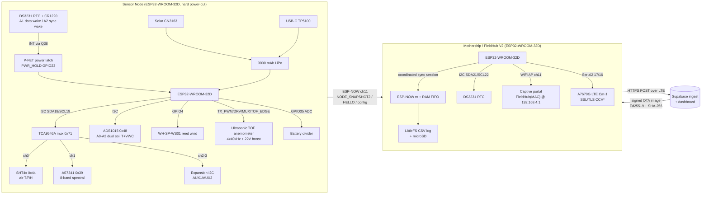

# FieldMesh — System Technical Snapshot (HardwareX paper reference)

**Compiled:** 2026-07-24 · **Source:** `Data-Logger-network---ESP32` firmware repository (node V3 + mothership/FieldHub V1/V2)

> Scope note: this document reports what is *in the repository as of the compile date* — firmware source, hardware design notes, and bench validation records. Where a value is design-intent-only, bench-verified, or still uncertain, it is flagged. Two chip-identity questions from the brief (ADS1015 vs ADS1115, AS7341 vs AS7343) are answered explicitly in §1 and §6.

---

## 1. Node hardware (NODE_v3)

### 1.1 Controller & board
- **MCU:** ESP32-WROOM-32 (dual-core), operating from `3V3_SYS`. PlatformIO target `board = esp32dev`; build identity `FW_HW_TARGET="node-v3"`, `FW_SEMVER="0.1.0"`.
- **Board status:** NODE_v3 PCB is at prototype-fabrication stage (Gerbers/BOM dated 2026-06-28; recommended first run 3–5 boards). V3 is a hardened revision of the V2 board — all V2 bring-up debugging happened on the V2 hardware; V3 is not yet electrically bench-validated.
- **Radio:** ESP-NOW on fixed channel **11** (shared with the mothership AP channel).

### 1.2 Sensor list (exact parts)

| Measurement | Part | Interface | Notes |
|---|---|---|---|
| Air T / RH | **Sensirion SHT4x (SHT41/SHT40)** | I²C 0x44, via mux ch0 | Adafruit_SHT4x, high precision, heater off. *(Early bring-up used SHTC3 at 0x70; production firmware is SHT4x.)* |
| Spectral | **ams AS7341** 11-channel | I²C 0x39, via mux ch1 | 8 visible bands (415–680 nm) + Clear + NIR. **The driver file/namespace is named `par_as7343` but the actual part and library are AS7341** (`Adafruit_AS7341`, `AS7341_I2CADDR_DEFAULT`). Answer to "AS7341 vs AS7343": **AS7341.** |
| Soil moisture + temp (×2 probes) | **CWT TH-A** type soil probes via **ADS1015** ADC | ADC on I²C 0x48 (root bus) | **Hardware BOM part is ADS1015 (12-bit).** The firmware helper class is named `ADS1115` (Vref 4.096 V) but uses the register-compatible ADS101x/111x interface, so it drives either. Answer to "ADS1015 vs ADS1115": **physical part = ADS1015; firmware helper is ADS111x-register-compatible.** |
| Wind (primary) | Custom **ultrasonic TOF anemometer** (4-transducer, 40 kHz) | GPIO timing capture | See §1.7. Bench status: **partial** (§4). |
| Wind (fallback) | **WH-SP-WS01** reed cup anemometer | Pulse count on GPIO4 | Mutually exclusive with ultrasonic RX (shares GPIO4). Runtime-selected via config mask, not a compile flag. |
| Battery voltage | On-board divider → ESP32 ADC | GPIO35 (ADC1) | See §1.5. |

Two firmware wind backends (`SENSOR_BACKEND_ULTRASONIC_WIND`, `SENSOR_BACKEND_REED_WIND`) both report as `SNAP_PRESENT_WIND`; the config mask picks which one registers.

### 1.3 I²C topology, addresses & mux channels
Single I²C bus (`WireRtc`, I2C0) on **SDA=GPIO18, SCL=GPIO19** carries the RTC, the mux, the ADC, and (through a PCA9306 level shifter) the 5 V/expansion side.

| Device | Address | Bus location |
|---|---|---|
| DS3231M RTC | 0x68 | Root bus |
| I²C mux | **0x71** (node build flag `MUX_ADDR=0x71`) | Root bus |
| ADS1015 soil ADC | 0x48 | Root bus |
| SHT4x air T/RH | 0x44 | **Mux channel 0** |
| AS7341 spectral | 0x39 | **Mux channel 1** |
| Expansion / AUX I²C | (device-dependent) | Mux channels 2–3 |

- **Mux part:** NODE_v3 uses a **TCA9546A (4-channel)** per the V3 design note; earlier boards/firmware defaults reference a PCA9548A (8-channel). Firmware `muxSelectChannel()` writes `1 << ch` to `MUX_ADDR`. `MUX_CHANNELS` defaults to 8 in `protocol.h` but the V3 board exposes 4 downstream I²C connectors. Firmware enables one channel at a time.
- Confirmed by bench I²C scan: `0x48, 0x68, 0x71` on root bus; `0x44` (SHT4x) on mux ch0.

### 1.4 ADS1015 ADC channel mapping (soil)
Single-ended channels, from `soil_moist_temp.cpp` (CWT TH-A wiring):

| ADC ch | Signal |
|---|---|
| A0 | Soil probe 1 temperature |
| A1 | Soil probe 1 moisture |
| A2 | Soil probe 2 moisture |
| A3 | Soil probe 2 temperature |

The node emits **raw sensor output volts** in the `SOIL1_VWC`/`SOIL2_VWC` channels (IDs 2001/2002); volts→VWC calibration is deferred to the backend to keep curves field-updatable. Soil temperature is converted on-node (CWT TH-A model, with a legacy Steinhart–Hart thermistor fallback path).

### 1.5 Battery monitoring
- Divider moved to `VSYS` (not continuously on the battery) → `VOLT_ESP` / **GPIO35**.
- Network: 220 kΩ / 100 kΩ divider + 100 nF, then 2.2 kΩ series into GPIO35. ~1.31 V at 4.2 V pack.
- Firmware: `BAT_ADC_PIN=35`, `BAT_ADC_SAMPLES=16`, `BAT_DIVIDER_SCALE=3.58` (bench-calibrated ~3.62 against a DMM in an earlier run). Averaged/median-filtered; low-battery thresholds still to be set from measured under-load behaviour.

### 1.6 Power architecture & wake
- **Hard power-cut architecture** (no deep sleep): when the node finishes a wake it releases `PWR_HOLD` and the board loses power entirely. RTC RAM does **not** survive — **NVS is the sole state store.**
- **Wake path:** DS3231 alarm → `INT/SQW` inverted through Q38 → drives a high-side P-channel MOSFET latch that switches `VSYS` on → ESP32 boots → firmware asserts `PWR_HOLD` (GPIO23, active-high) to hold the latch → then clears the RTC alarm flag. (Order matters: clearing the alarm before asserting PWR_HOLD would drop the rail mid-boot.)
- **PWR_HOLD:** GPIO23. `ENABLE_POWER_HOLD_CONTROL=1`, `PWR_HOLD_ACTIVE_HIGH=1`.
- **Two alarms (DS3231):** Alarm1 (A1) = data-cycle wake (`now + wakeInterval`); Alarm2 (A2) = fleet sync-window wake (minute-resolution, phase-anchored). See §3.
- **Watchdog:** hardware timer (`NODE_WDT_TIMEOUT_S=120`) reboots on a hung loop (e.g. an I²C stall) so a node can't sit "hung on" draining the pack.
- **GPIO4 caveat:** the vestigial `RTC_INT_PIN=4` flag is a software misnomer — GPIO4 is the `RX_EN_N` / reed-input net, **not** the RTC INT. The wake is purely the hardware FET gate; there is deliberately no ext0 deep-sleep fallback.
- **Battery:** single-cell LiPo, **3000 mAh** (up from 2000 mAh on earlier builds), 1.25 mm 2-pin connector, Q37 P-FET reverse-polarity protection + resettable fuse.
- **Charging:** dual — **CN3163** solar charger (~330 mA, single-cell LiPo, TEMP grounded) and **TP5100** USB-C charger (~500 mA, 0.20 Ω sense, 0.75 A-hold PPTC). Both feed `BAT_BUS`; solder-jumper isolation links for fault-finding.
- **Rails:** AP2112K-3.3 LDO → `3V3_SYS`; MT3608 boost → `5V_SYS` (always on with VSYS); second MT3608 boost → **~22.2 V** for the ultrasonic TX (firmware-enabled via `TX_22V_EN_N`/U49). Always-on keep-alive LDO (TPL720F33) powers the RTC + CR1220 backup when the main system is off.

### 1.7 Ultrasonic subsystem
- **Transducers:** 4 TX + 4 RX (N/E/S/W), 40 kHz. Path length ≈ **146.70 mm**, still-air TOF ≈ **427 µs** (20 °C), pod tilt ≈ 32.3°, projection factor p ≈ **0.5344**.
- **TX chain:** GPIO25 `TX_PWM` → TC4427 gate driver (on 5 V) → Q21/Q16 global high-side 40 kHz switch → `TX_PULSE` (>20 V) → per-direction P-MOSFET (DRV_N/E/S/W = GPIO26/27/14/13) to the selected transducer; CJ2310 damping MOSFETs (REL/DAMP_N/E/S/W = GPIO33/32/21/22). 22 V boost enabled once per measurement *batch* via `TX_22V_EN_N=GPIO5`.
- **RX chain:** 74HC4052 mux (MUX_A=GPIO16, MUX_B=GPIO17; RX_EN_N=GPIO4) → BAV99 clamp / VREF bias → TLV9062 two-stage op-amp (~52 V/V, ~34 dB, broadband ~40 kHz) → MCP6561 comparator vs VREF (~1.65 V) → digital blanking (`TOF_EDGE = COMP_RAW AND NOT RX_EN_N`) → **timer capture on GPIO34 (`TOF_EDGE`)**.
- **Algorithm:** reciprocal bidirectional TOF, `U_axis = (L/2p)(1/t_AB − 1/t_BA)`, with speed-of-sound health check `c = (L/2)(1/t_AB + 1/t_BA)`; 16–64 shots/direction, median-filtered, gate-windowed.
- **Recommended production firmware** (design note, not yet implemented): RMT/MCPWM carrier generation + MCPWM/RMT capture at 100 ns resolution, and a 9-state measurement machine (SAFE_IDLE → … → CLEANUP).

### 1.8 Connectors & AUX
The **CN11–CN20 designators do exist** in the NODE_v3 BOM as ten board-edge 4-pin connectors (the sensor/expansion plugs; each wired to an aviation-plug pigtail). The BOM gives the connector *inventory*; the per-connector function assignment (which CN is I²C vs soil vs wind) lives in the EasyEDA schematic, not in a repo markdown:

| Designators | Part | Type |
|---|---|---|
| **CN11–CN14** | JST **B2B-PH-SM4-TB** | 4-pin PH, top-entry |
| **CN15–CN20** | JST **BM04B-SRSS-TB** | 4-pin SR, side-entry |

Pin conventions by cable function (from `SENSOR_WIRING_AVATION_PLUGS.md` + NODE_v3 design note):
- **I²C sensor plugs (aviation, 4-pin):** 1=GND, 2=SDA, 3=SCL, 4=PWR.
- **Wind (aviation, 2-pin):** 1=GND (black), 4=SIGNAL (red).
- **Soil (aviation, 4-pin):** 1=GND, 2=Temp, 3=Moisture, 4=PWR.
- **Expansion / AUX I²C ports (TCA9546A, ×4, 4-pin JST):** 1=3V3_SYS, 2=GND, 3=SDA, 4=SCL.
- **AUX wind (2-pin JST):** 1=GND, 2=REED_SIG → GPIO4 (shares `RX_EN_N`; mutually exclusive with ultrasonic; 1 kΩ series protection recommended).
- **Battery (1.25 mm, 2-pin):** 1=BAT+, 2=GND.
- **Two selectable-voltage sensor outputs:** each can source ~5 V or ~22 V (diode-OR'd, high-side P-FET switch) — for sensors explicitly rated to the selected voltage only.
- **Two AUX firmware channels:** `AUX1`/`AUX2` (sensor IDs 3001/3002) are passive, mask-gated I²C aux slots on the expansion mux (`sensors_aux_i2c`).

> **To confirm for the paper:** the literal per-CN pin *function* table (which of CN11–CN20 carries I²C vs soil vs wind) must be read off the NODE_v3 EasyEDA schematic (`hardware/NODE_v3/`); the BOM confirms the ten connectors but not their net assignments.

---

## 2. Mothership (FieldHub)

- **Not breadboard — PCB-based.** Firmware target `mothership-v1` on a **FieldHub V1 PCB**; a **FieldHub_v2** PCB now exists (`hardware/FieldHub_v2/`, BOM + pick-and-place dated **2026-07-24**).
- **MCU:** **ESP32-WROOM-32D-N4** (confirmed from FieldHub_v2 BOM, designator U45; PlatformIO `board = esp32dev`). *Not an ESP32-S3 — earlier bench notes referenced an `esp32s3` env on a dev board, but the FieldHub PCB is populated with a WROOM-32D.*
- **RTC:** DS3231MZ (U49) on I²C **SDA=GPIO21, SCL=GPIO22** (0x68). Mothership has its own PWR_HOLD/config-latch wake architecture (GPIO26 PWR_HOLD, GPIO32 config-wake, GPIO25 config-clear; config latch = SN74LVC2G74 flip-flop, U52).
- **Local storage:** LittleFS (internal flash) is the primary CSV log store in current firmware. FieldHub_v2 also carries a **microSD (TF-card) socket (TF1)** on SPI (**CS=13, SCK=18, MISO=19, MOSI=23**).
- **USB/charging:** USB-C (U54) + CH340C USB-UART (U38); CN3163 solar charger (U23); MF-MSMF050 fuse. Micro-SIM socket (SIM1); **U.FL RF antenna connector (JP1)** for the LTE antenna.
- **Wi-Fi AP:** captive-portal config AP. SSID = **`FieldHub(<MAC>)`** (WPA2, `ESPNOW_CHANNEL=11`, max 4 clients), captive portal + DNS at **`192.168.4.1`**. (Legacy V1 firmware used a `Logger<ID>` SSID pattern.)
- **LTE backhaul:** **SIMCom A7670G** Cat-1 modem (U58; A7670G-LABE, firmware A110B06A7670M7) is **integrated on the FieldHub PCB** (not conceptual). Power: TPS63020 buck-boost (U59), PWM soft-start on `4V_EN` (GPIO33), power-good on GPIO35, PWRKEY pulse (GPIO14, 1100 ms), STATUS on GPIO4. UART: Serial2 on **TX=GPIO17 / RX=GPIO16** at 115200 through SN74LVC1T45 level shifters (U60–U62). SSL/TLS via the modem's CCH* API with chunked (1024-byte) sends.
  - **Verified:** AT handshake, IMEI, SIM detection, network registration (bench Tests 9–13); chunked HTTPS GET and full cloud-OTA image download (1.3 MB) bench-proven.
  - **Pending:** full production over-the-air *upload* is gated on antenna/field RF validation.

---

## 3. Firmware architecture

### 3.1 Node states
`enum NodeState { UNPAIRED=0, PAIRED=1, DEPLOYED=2 }`, derived from persisted state:
- **UNPAIRED** — no mothership MAC. Idle loop announces MAC-derived ID; powers off after 15 min if not deployed.
- **PAIRED** — has mothership MAC, `deployedFlag=false`.
- **DEPLOYED** — mothership MAC + `deployedFlag=true`; runs the A1/A2 wake schedule.
- Transitions: PAIR_NODE/PAIRING_RESPONSE sets the MAC (→PAIRED); DEPLOY_NODE sets RTC + `deployedFlag` (→DEPLOYED); UNPAIR (or `NODE_CONFIG targetState=0`) wipes credentials (→UNPAIRED). A **paused/standby** sub-state (`g_recordingPaused`) keeps the node DEPLOYED and doing sync check-ins but skips sampling and the A1 recording alarm.

### 3.2 Wake cycle (deployed)
- **A1 (data wake):** clear A1 flag → capture sensors to local queue (radio off) → re-arm A1 (`now + wakeInterval`) → schedule power cut. Capture order per wake: **battery first**, then registry sensors (SHT4x → AS7341 bands → soil → wind → AUX), then AS7341 metadata (Clear/NIR/gain/integration/saturation) appended.
- **A2 (sync wake):** bring up ESP-NOW → send NODE_HELLO (+ FW_CAPS) → listen ~60 s → flush queue during the coordinated sync session → radio off → re-arm A2 → power cut.
- **Combined A1+A2:** sample first, then sync flush, single `finalizeWakeAndSleep`, power cut once.
- One **snapshot per wake** (not per sensor): `NODE_SNAPSHOT2` (V2 key/value format, 48-byte header + up to 33 × 6-byte readings). Legacy fixed `NODE_SNAPSHOT` (124 B) still defined for compatibility.

### 3.3 Sync window & queue flush
- Nodes learn *when* to sync from a shared phase anchor: `syncPhaseUnix` + `syncIntervalMin`, programmed into DS3231 **Alarm2** (minute-resolution, minute-aligned). All nodes compute the same next slot.
- Mothership opens a bounded, **coordinated pull session**: `SYNC_SESSION` → jittered NODE_HELLO roster → per-node `DUMP_GRANT` (fairness quota + window) → node sends snapshots → `DUMP_DONE` → `SYNC_RELEASE` (final clock + new phase) → `RELEASE_ACK`. `sessionId`/`grantId` make late packets from an earlier wake harmless.
- **Flush safety:** records are peeked, sent, and only popped after `onDataSent` delivery confirmation (fixes silent loss); a wall-clock deadline stops flush from consuming the whole listen window.
- **Sync fail:** if the marker/session isn't seen, the queue is left intact and alarms re-armed — no data loss. **Stale recovery** (bilateral): if `lastTimeSyncUnix` age > 24 h, the node runs a bounded ESP-NOW recovery (HELLO + REQUEST_TIME) during a data wake; the mothership independently assists nodes it infers are stale.
- **Auto-derived sync cadence:** `syncMin = wakeMin × 18` (K=18 rule) keeps queue fill at ~82 % of the 22-snapshot safe ceiling; sync interval is **never user-settable**.

### 3.4 ESP-NOW protocol (packet types)
All structs in `node/firmware/shared/protocol.h` (single source of truth), `NODE_PROTOCOL_VERSION=2`:

| Direction | Message(s) |
|---|---|
| Discovery/pair | DISCOVER_REQUEST/RESPONSE, PAIRING_REQUEST/RESPONSE, PAIR_NODE |
| Deploy/config | DEPLOY_NODE (+ embedded RTC time, configVersion, wakeInterval, syncInterval, syncPhase, sensorMask), DEPLOY_ACK, SET_SCHEDULE, SET_SYNC_SCHED, **NODE_CONFIG** (unified declarative), CONFIG_SNAPSHOT / CONFIG_ACK, UNPAIR_NODE |
| Time | REQUEST_TIME, TIME_SYNC |
| Data | **NODE_SNAPSHOT2** (V2, primary), NODE_SNAPSHOT (V1 legacy), SNAPSHOT_ACK |
| Handshake/health | NODE_HELLO, **FW_CAPS** (fw version/build/OTA A/B slot state), NODE_STATUS |
| Coordinated sync | SYNC_SESSION, DUMP_GRANT, DUMP_DONE, SYNC_RELEASE, RELEASE_ACK |

`static_assert`s pin every wire size (e.g. `node_snapshot_t==124`, `node_config_message_t==60`, `deployment_command_t==92`). All within the 250-byte ESP-NOW ceiling.

### 3.5 NVS persistence (survives power loss)
Persisted via `node_config_store`: mothership MAC, node state, `rtcSynced`, `deployedFlag`, `rtcPowerLost`, recovery reason, `wakeIntervalMin`, `syncIntervalMin`, `syncPhaseUnix`, `lastTimeSyncUnix`, `lastSyncSlot`, `appliedConfigVersion`, `recordingPaused`, and the **sensor mask**. The sensor snapshot queue is a separate checksummed (FNV-1a) NVS blob, 24 slots. NVS mount failure is never auto-erased (a pending OTA image that can't mount NVS rolls itself back instead), protecting deployed-node identity.

### 3.6 ConfigVersion / declarative NODE_CONFIG
- **Implemented.** `NODE_CONFIG` is a version-gated declarative message: the mothership holds each node's desired state and re-broadcasts every sync window until the node's echoed `configVersion` matches. Idempotent (node applies only a strictly newer version). `targetState` folds unpair (0) / deployed (2) in; carries `wakeIntervalMin`, `syncIntervalMin`, `syncPhaseUnix`, `sensorMask`.
- A shared `command_dispatcher` (mothership-owned monotonic revision, compare-and-set, supersession, idempotent replay, NVS-persisted) is **bench-proven (18/18 + reboot)** but per the repo notes is **not yet fully wired into the config_server / NODE_CONFIG delivery path** — the live path currently uses the DEPLOY/CONFIG_SNAPSHOT + NODE_CONFIG replay flow. *(State this carefully in the paper.)*

### 3.7 Sensor mask & `0x0137`
Per-node "expected sensors" bitmask (`SNAP_PRESENT_*` layout, reused for both config and the snapshot's `sensorPresent`):

| Bit | Value | Sensor |
|---|---|---|
| 0 | 0x0001 | AIR_TEMP |
| 1 | 0x0002 | AIR_RH |
| 2 | 0x0004 | SPECTRAL (8-band group) |
| 3 | 0x0008 | WIND |
| 4 | 0x0010 | SOIL1 |
| 5 | 0x0020 | SOIL2 |
| 6 | 0x0040 | AUX1 |
| 7 | 0x0080 | AUX2 |
| 8 | 0x0100 | BAT_V |
| 15 | 0x8000 | MASK_VALID (mask is authoritative; else auto-detect) |

- **`0x0137`** = BAT_V + SPECTRAL + AIR_RH + AIR_TEMP + SOIL1 + SOIL2 = `0x100 | 0x04 | 0x02 | 0x01 | 0x10 | 0x20` — i.e. **the full standard node set present** (air T, air RH, spectral, both soil groups, battery), no wind/AUX.
- **`0x0133`** = same but with the spectral bit cleared — this is the mask seen on the one 3-node-test unit whose spectral sensor was miswired (§4).
- Self-identifying I²C parts (SHT4x, AS7341) are always auto-detected; **passive** sensors (wind, soil, AUX) are only registered when their mask bit is set (or in legacy mask-0 auto mode). Ultrasonic vs reed wind is disambiguated by a separate config bit (`NODE_SENSOR_CFG_WIND_ULTRASONIC`, 0x0200).

### 3.8 Over-the-air config (no reflash)
Changeable over ESP-NOW without reflashing: wake interval, sensor selection (mask), deploy / stop(pause) / unpair (via `targetState`), sync phase/interval (auto-derived), and RTC time. Firmware images themselves update via the separate signed-OTA path (Ed25519 manifest + SHA-256, A/B slots, deferred-verify rollback — bench-proven on both node and mothership).

---

## 4. Commissioning results (bench)

### 4.1 Single-node (5 May 2026, node `ENV_945DC4`)
End-to-end path **PASS**: sensor capture → local queue → sync-window flush → mothership reception → SD/flash CSV. Rows carried valid battery, air T, RH, 8 spectral bands, and dual soil channels with `sensor_present = 0x0137`.

### 4.2 Three-node (5 May 2026)
Nodes `ENV_94DF54` (NODE 1), `ENV_945DC4` (NODE 2), `ENV_94E38C` (NODE 3). Wake cadence **1 min**, auto-derived sync **18 min**. **PASS with one local hardware issue:**
- Concurrent wake cycles + shared sync-window backlog flush worked with no transport/receive-path collapse.
- 2/3 nodes reported the full set (`0x0137`); NODE 1 reported `0x0133` (spectral absent) — traced to a **local wiring fault**, later corrected in hardware, not a firmware/transport defect.
- Air-T, RH, soil-temp stable and plausible; soil-moisture values operationally useful but **provisional scaling**, not final calibrated VWC.
- Earlier 4-node fleet flush stress (FN-3, wakeMin=1/syncMin=5) **failed** (≈27 rows lost/3 cycles) due to SD writes blocking the ESP-NOW receive callback — **fixed** by the NODE_SNAPSHOT redesign (1 packet/node/wake) + deferred RAM-FIFO→SD drain; the 5 May run used the fixed architecture.

### 4.3 ESP-NOW range test
- 1 m LOS: **~98.5 % ACK**
- 30 m LOS: **~99.7 % ACK**
- 100 m weak/obstructed LOS: **~84–87 % ACK** (usable but degraded)

### 4.4 Power-cycle / persistence
Hard power-cut every wake; state reloads from NVS on each boot. Validated: config/state survival, checksum detection of partial writes (no duplicate records), RTC lost-power detection forcing re-sync, and confirmed rail drop on PWR_HOLD release.

### 4.5 Sensor-by-sensor
| Sensor | Result | Notes |
|---|---|---|
| SHT4x air T/RH | **PASS** | e.g. 18.4–19.9 °C, 44–66 % RH stable |
| AS7341 spectral | **PASS** (2/3 nodes in fleet run) | 8 bands present, low-but-nonzero indoor counts; metadata (Clear/NIR/gain/integration/saturation) fixed after the null-metadata bug (2026-07-04) |
| Soil temp | **PASS** | stable, plausible |
| Soil moisture | **PARTIAL** | raw volts logged; **calibration to VWC pending** |
| Battery ADC | **PASS** | firmware within ~1 mV of DMM after scale cal |
| RTC / dual-alarm | **PASS** | set/readback, alarm fire, flag clear/re-arm, gate trigger |
| Charging (solar/USB/dual) | **PASS** | |
| Reed wind | Backend implemented + bring-up test exists | not in the 5 May multi-sensor run |
| Ultrasonic wind | **PARTIAL** | see §4.6 |

### 4.6 Ultrasonic — why "partial"
On the V2 board, route-finder tests reported `DET=24/24` in **both** open and blocked acoustic paths — i.e. detections were dominated by **electrical feedthrough / comparator overdrive** (aggravated by the removed D8/D9 RX-protection diodes), not by genuine acoustic first-arrival. Acoustic discrimination was therefore **not yet achieved** on V2. NODE_v3 redesigned the RX front-end (locally filtered rails, shortened high-impedance nodes, corrected TX gate drive, deterministic TX_PULSE low, damping logic) specifically to fix this, but **V3 acoustic timing is still pending electrical bring-up.** Wind should be described in the paper as a **not-yet-validated channel / placeholder**.

---

## 5. Cloud / dashboard

- **Pipeline (LTE → Supabase):** the mothership posts a flat JSON array of readings (plus `{meta,status}`) via HTTPS over the A7670G to a Supabase ingest endpoint (keyed by mothership UUID + device MAC; 400/401 treated as non-retryable). This is **implemented and integrated** in mothership V2 firmware; modem AT/registration and chunked HTTPS transfers are bench-proven, and cloud-OTA image download (Supabase Storage) is bench-proven at full 1.3 MB.
- **Status for V1 paper:** end-to-end production *upload over the air* is gated on antenna/field-RF validation. Recommended framing: describe the cloud path as **implemented and bench-validated at the transport level, with full field upload as near-term work** — or scope it out of V1 and present the on-site CSV (LittleFS/SD) log as the primary V1 data product. Either is defensible; do **not** claim a completed long-run field upload campaign, which the repo does not evidence.

---

## 6. What changed since the build-paper draft

- **New hardware revisions:** **NODE_v3** (2026-06-28 Gerbers/BOM; hardened ultrasonic + power/charging fixes over V2) and **FieldHub_v2** mothership PCB (2026-07-24 BOM/CPL). The build-paper draft (`docs/archive/manuscript/ERS381_*`) predates both.
- **Sensor identities (answers to the brief's questions):**
  - Air T/RH: **SHT4x (SHT40/41)** in production — earlier bring-up used **SHTC3** (0x70). Changed.
  - Spectral: **AS7341** (driver misnamed `as7343`; not an AS7343 part). Effectively unchanged part, corrected naming.
  - Soil ADC: **ADS1015** on the board (firmware helper is ADS111x-register-compatible). Consistent with V2; note the 12-bit part, not ADS1115.
- **Firmware features added since the draft:** V2 snapshot protocol (1 packet/node/wake) + wide-format CSV; coordinated pull-based sync session (SYNC_SESSION/DUMP_GRANT/…); declarative version-gated NODE_CONFIG + sensor mask; delivery-gated queue pop; bilateral stale-node recovery; per-node standby/pause; hardware watchdog; signed A/B OTA with deferred-verify rollback (node + mothership); Supabase cloud upload + cloud-OTA download; AS7341 extended metadata + saturation-flag fix; forward-facing local-time presentation plan (RTC/sync stay UTC).

---

## Open items to confirm before submission
1. **Per-CN pin function** — CN11–CN20 confirmed as ten 4-pin connectors in the BOM; the net-to-pin assignment per connector is only in the NODE_v3 EasyEDA schematic.
2. **command_dispatcher wiring** — proven in isolation; confirm whether the live config path uses it or the DEPLOY/CONFIG_SNAPSHOT replay flow at the moment of writing.
3. **Soil moisture calibration** — present as provisional volts, not calibrated VWC, unless new calibration exists.
4. **Ultrasonic wind** — present as design-complete but not acoustically validated on V3.
5. **Cloud upload** — bench-validated transport; no completed field-upload campaign in the repo.

*(Resolved during compile: FieldHub MCU is ESP32-WROOM-32D-N4, not S3; node soil ADC is ADS1015IDGSR; node mux is TCA9546A; spectral part is AS7341; air T/RH is SHT4x.)*

---

## Appendix A — Key parts (from JLCPCB/LCSC BOMs)

**Node V3** (`hardware/NODE_v3/BOM_Board1_PCB1_2026-06-28.csv`) — board-mounted actives. *(Air T/RH and spectral sensors are external modules on the CN plugs, not board-mounted.)*

| Function | Designator | Part | LCSC |
|---|---|---|---|
| MCU | U45 | ESP32-WROOM-32D-N4 | C473012 |
| RTC | U5 | DS3231MZ+TRL | C107410 |
| Soil ADC (12-bit) | U30 | **ADS1015IDGSR** (TI) | C193969 |
| I²C mux (4-ch) | U33 | **TCA9546APWR** (TI) | C201653 |
| I²C level shifter | U29 | PCA9306DC1 (NXP) | C129510 |
| RX analog mux | U42 | 74HC4052 | C507179 |
| RX op-amp | U43 | TLV9062IDR (TI) | C398355 |
| RX comparator | U44 | MCP6561T-E/OT | C117501 |
| TX gate driver | U46 | TC4427EOA | C636891 |
| 22 V EN inverter / blanking | U49/U50/U51 | SN74LVC1G04 / …G08 | C198296xx |
| Main 3V3 LDO | U20 | AP2112K-3.3 | C51118 |
| Keep-alive LDO | U8 | TPL720F33-3TR | C2842389 |
| 5 V & 22 V boost | U21/U22 | MT3608 | C84817 |
| Solar charger | U23 | CN3163 | C559031 |
| USB charger | U24 | TP5100 | C379389 |
| USB-UART | U38 | CH340C | C84681 |
| Sensor/expansion conn. | CN11–CN14 | JST B2B-PH-SM4-TB | C160352 |
| Sensor/expansion conn. | CN15–CN20 | JST BM04B-SRSS-TB | C160390 |
| RTC backup cell | B1 | CR1220 | C70381 |

**FieldHub V2** (`hardware/FieldHub_v2/BOM_Board1_PCB1_2026-07-24.csv`)

| Function | Designator | Part | LCSC |
|---|---|---|---|
| MCU | U45 | ESP32-WROOM-32D-N4 | C473012 |
| LTE modem | U58 | **A7670G** (SIMCom) | C5846957 |
| Modem power (buck-boost) | U59 | TPS63020DSJR (TI) | C15483 |
| Modem UART level shift | U60–U62 | SN74LVC1T45DCKR | C9382 |
| RTC | U49 | DS3231MZ+TRL | C107410 |
| Config latch (flip-flop) | U52 | SN74LVC2G74DCUR | C7851 |
| microSD socket | TF1 | TF-CARD H1.8 | C7529391 |
| Micro-SIM socket | SIM1 | Micro-SIM 7P | C7529381 |
| LTE antenna conn. | JP1 | U.FL-R-SMT-1 | C88374 |
| USB-UART | U38 | CH340C | C84681 |
| USB-C | U54 | Type-C 16P | C3151748 |
| Solar charger | U23 | CN3163 | C559031 |
| Main 3V3 LDO | U50 | AP2112K-3.3 | C51118 |
| Keep-alive LDO | U51 | TPL720F33-3TR | C2842389 |
| USB ESD | U56 | TPD2EUSB30DRTR | C5182099 |

---

## Appendix B — System block diagram

*ASCII fallback:* Node (RTC-gated ESP32; SHT4x + AS7341 on TCA9546A mux, ADS1015 soil, reed/ultrasonic wind, battery ADC; LiPo + solar/USB charging) → **ESP-NOW ch11** → FieldHub (ESP32-WROOM-32D; coordinated sync pull → LittleFS/microSD CSV; DS3231; captive Wi-Fi AP; A7670G LTE) → **HTTPS/LTE** → Supabase cloud (ingest + dashboard; signed OTA back to the hub).
